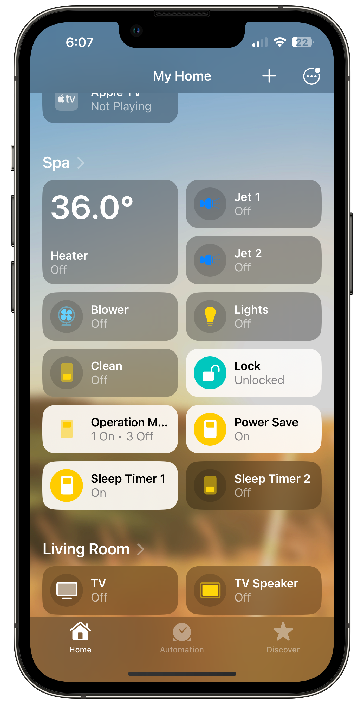

<p align="center">
  
</p>

# homebridge-spanet
Homebridge SpaNET is a [Homebridge](https://github.com/homebridge/homebridge) plugin for controlling Australian/NZ spas with a SpaNET WiFi module. Spas that can be controlled with the SpaLINK app can be used. The plugin for Homebridge allows Homekit integration to control your spa, allowing you to integrate it into your smart home and control via routines/voice commands or however you like.

# Installation
Please ensure you are running the latest version of Homebridge (heres how to [install](https://github.com/homebridge/homebridge/wiki) if you haven't already). To install this plugin, run the following command on your Homebridge hosts command line/terminal application:
```
npm i -g https://github.com/BlaT2512/homebridge-spanet
```
NOTE: For best performance, and due to the number of accessories this device exposes it is recommended you run this plugin on a child bridge (Homebridge Web Interface > Plugins > homebridge-spanet > Bridge Settings).

# Setup
Configure the plugin in Homebridge Web Interface > Plugins > homebridge-spanet > Settings

Username: The username you use to access the SpaLINK app

Password: Encrypted form of your password. You can obtain this by following [this link](https://github.com/thehoff/spanet-password-creator) and downloading the binary for your platform.

Spa Name: The name of the spa you want to expose. At this time you can only expose one spa, support for more may come in a later release.

# Features
Here is the things you can control using this plugin through HomeKit:
* See the temperature of the spa and set a temperature for it to heat/cool to
* Turn on and off the spa lights (the lights will use the last set mode) and change the brightness
* Turn on and off the blower (variable mode) and change the speed
* Turn on and off jets 1 & 2 (pumps 2 & 3) and set the jet timeout
* Turn on and off clean cycle for the spa
* Turn on and off the keypad lock
* Set the operation mode (normal, economy, away or weekdays mode)
* Turn on and off power saving mode (will set to power save low mode)
* Turn on and off sleep timer 1 & 2 (uses already set configuration)

<p align="center">
  
</p>

# Known Issues
In the current release (v1.0) the following bugs have been recorded:
* Turning on and off the keypad lock or jets will complete this action but HomeKit may be stuck loading trying to turn it on or off (closing and opening the app will then show it's new state properly)
Please file a bug report in this repo's issues if you encounter any.

# Upcoming Features
Here are the features planned for v1.1 or future releases:
* Fix keypad lock and jets infinite load bug (affects some people)
* Allow jets 4 & 5 to be controlled if they are installed
* Give option for default power save mode in Homebridge settings (LOW or HIGH)
* Allow controlling of lights hue/saturation/colour in HomeKit
* Show how long jets have left before they timeout when they are on
* Allow multiple spa's to be exposed to HomeKit
* Upgrade code to new Promise-based `onGet` and `onSet` methods
* Encrypt password automatically instead of having user do it beforehand
* Verify plugin on Homebridge
